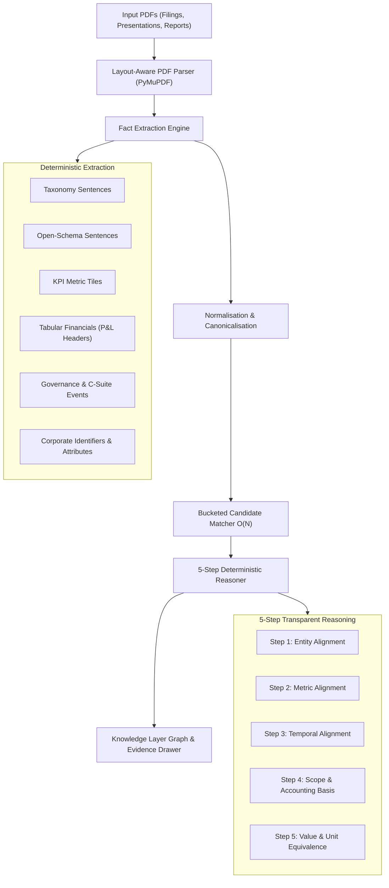

# Fact Knowledge Layer

> **An evidence-backed cross-document knowledge workspace**: upload financial, corporate, and macroeconomic PDFs to extract grounded facts, link every claim to its exact source sentence and bounding box, and determine whether claims across documents **corroborate**, **contradict**, or **reconcile through contextual differences** (scope, period, unit, accounting basis, or temporal revisions).

Built as a submission for the **Superjoin VIT 2026 Engineering Intern** hiring assignment.

---

## ⚡ Quickstart

Runs **100% locally with zero external API dependencies or paid services required**. An optional hybrid LLM mode can be enabled for semantic predicate family clustering.

### Prerequisites
- **Python 3.9+**
- **Node.js 18+** / npm

### 1. Backend Service (FastAPI + PyMuPDF)

```bash
# Clone and enter directory
git clone https://github.com/gopiadithya/Fact-Knowledge-layer.git
cd Fact-Knowledge-layer

# Create and activate Python virtual environment
python -m venv backend/.venv

# Windows (PowerShell):
backend\.venv\Scripts\activate
# macOS / Linux:
# source backend/.venv/bin/activate

# Install dependencies
pip install -r backend/requirements.txt

# Run the full automated test suite (81 tests, ~35s)
python -m pytest backend/tests -q

# Start the API server on port 8000
python -m uvicorn backend.app.main:app --host 127.0.0.1 --port 8000
```

> **Note**: Always run from the repository root directory so `backend.app.*` resolves properly on `sys.path`.

### 2. Frontend Workspace (React + TypeScript + Vite)

In a separate terminal:

```bash
cd frontend
npm install
npm run dev -- --port 5173
```

- Open **http://localhost:5173** in your browser.
- Interactive API documentation is available at **http://127.0.0.1:8000/docs**.

---

## 🏗️ Architecture & Pipeline



### How Each Stage Operates

1. **Layout-Aware PDF Parser (`backend/app/services/parser.py`)**:
   - Uses PyMuPDF to extract text blocks with explicit bounding boxes.
   - Detects multi-column reflow to fix interleaved lines common in official reports (e.g. RBI & IMF two-column layouts).
   - Pairs isolated numeric callouts with their adjacent label blocks to parse **KPI highlight tiles** on slide decks.
2. **Deterministic Fact Extraction (`backend/app/services/extractor.py`)**:
   - **Taxonomy Sentences**: Links metric keywords, normalized numbers, and temporal periods within a sentence.
   - **Open-Schema Sentences**: Discovers new measurements outside standard finance using linguistic patterns (`<metric> stood at/reached <value>`).
   - **Multi-Period Financial Tables**: Parses structured financial statement tables with column periods and scale headers (`in €m FY 2023 FY 2024`).
   - **Corporate Identifiers & Attributes**: Captures CIN, ISIN, registered office, auditor, and incorporation details.
   - **Governance Events**: Detects executive appointments, resignations, and board committee changes with exact effective dates.
3. **Unit & Period Normalizer (`backend/app/services/normalizer.py`)**:
   - Canonicalizes Indian and Western scales: *crore*, *lakh*, *million*, *billion*, *trillion*, *thousand*, *bps*, and percentage points into uniform base units.
   - Normalizes periods: converts `FY24`, `Fiscal 2024`, `2023-24`, `Q4 FY24`, `H1 FY25`, `nine months ended Dec 31`, and calendar dates into canonical fiscal windows.
   - Handles accounting conventions: parses negative parentheses like `(452)` and phrases like `loss of ₹...` into signed values.
4. **Bucketed Candidate Matcher (`backend/app/services/matcher.py`)**:
   - Partitions facts into candidate buckets indexed by `(entity_canonical, predicate_family, unit)`.
   - Prevents combinatorial O(N^2) explosion across large corpuses while enabling sub-second incremental updates when new files are uploaded.
5. **Deterministic 5-Step Reasoner (`backend/app/services/reasoner.py`)**:
   - Evaluates pairs across 5 explicit gates: **Entity**, **Metric**, **Period**, **Scope/Accounting**, and **Value Equivalence**.
   - Outputs transparent verdicts with full explanations: `CORROBORATED`, `CONTRADICTION`, `CONTEXTUALLY_EXPLAINED`, or `INSUFFICIENT_EVIDENCE`.

---

## 🔬 The 5-Step Reasoning Trace

Every pair evaluated by the engine generates a step-by-step trace accessible directly in the UI:

| Step | Check Name | Evaluation Logic |
| :--- | :--- | :--- |
| **1** | **Entity Alignment** | Confirms whether both claims describe the same company, government entity, or person. Identifiers and slugs prevent cross-company leakage. |
| **2** | **Metric Alignment** | Verifies that both statements describe the same measurable quantity (e.g. `financial.revenue` vs `financial.ebitda`). Distinguishes levels from percentage movements. |
| **3** | **Temporal Alignment** | Compares fiscal periods. If periods differ, routes the pair as non-conflicting historical timeline points. |
| **4** | **Scope & Accounting Basis** | Checks for contextual differences: Consolidated vs. Standalone, As-reported vs. Non-GAAP/Adjusted, Company vs. Nationwide/Industry statistics, or Advance vs. Revised estimates. |
| **5** | **Value & Unit Equivalence** | Compares base values using domain-aware tolerance thresholds (1.0% relative tolerance for rounded metrics; 0.05 absolute points for percentages). |

---

## 🎯 Verification of the 4 Required Cases

All cases are grounded in real documents and validated via automated pytest regression suites:

### 1. Corroborated Across Formats & Scalings
*Even when expressed with different words, units, or scales, the engine matches and validates facts:*
- **Delhivery Revenue FY24**:
  - *Annual Report (p. 36)*: *"Revenues from customers increased by 12.68% to ₹81,415.38 million for FY24..."*
  - *Q4 Earnings Deck (p. 6)*: Tile stating **₹8,142 Cr** labelled *"FY24 revenue from services"*.
  - **Verdict**: `CORROBORATED` (relative difference: 0.01%, well within the 1% rounding threshold).
- **DHL Group Revenue FY24**:
  - *Annual Report (p. 36)*: **€84,186 million**.
  - *Q4 Presentation (p. 21)*: **€84,186 million**.
  - **Verdict**: `CORROBORATED`.
- **DHL Group EBIT FY24 (Rounded Deck vs Exact Report)**:
  - *Earnings Presentation*: **€5.9bn**.
  - *Annual Report*: **€5,886 million**.
  - **Verdict**: `CORROBORATED` (difference 0.238% within rounding bounds).
- **Macro GDP Growth**:
  - *RBI Annual Report (p. 8)*: *"real gross domestic product (GDP) growth moderated to 6.5 per cent in 2024-25"*.
  - *IMF Article IV Report (p. 3)*: *"Following economic growth of 6.5 percent in FY2024/25..."*.
  - **Verdict**: `CORROBORATED`.

### 2. Genuine Contradiction (Competing Estimates)
*Real, un-reconcilable disagreements across authoritative sources:*
- **Headline Inflation Forecast for FY26**:
  - *Economic Survey 2024-25 (p. 87)*: *"Assuming a normal monsoon... RBI expects headline inflation to be **4.2 per cent** in FY26."*
  - *IMF Article IV Report 2025 (p. 13)*: *"Headline inflation is expected to remain benign and average **2.8 percent** in FY2025/26..."*
  - **Verdict**: `CONTRADICTION` (Factor: `COMPETING_ESTIMATES`, 1.40 percentage points apart with identical forward-looking context).
- **Synthetic Conflict Dataset (`starter-datasets/synthetic-conflict/`)**:
  - Exercises two independent PDFs for the same company and fiscal year asserting ₹1,240 Cr vs ₹1,180 Cr with no scope or accounting delta, while corroborating on EBITDA.

### 3. Apparent Contradictions Explained by Context
*Differences that initially look like errors but are fully explained by metadata or context:*
- **Scope Difference (Company vs Nationwide Market)**:
  - *Blue Dart 2023-24 Report*: Company Express Parcel Shipments = **3,587.62 lakh**.
  - *Blue Dart 2022-23 Report*: *"In the just-ended fiscal (FY23), India shipped over 4 billion e-commerce parcels"*.
  - **Verdict**: `CONTEXTUALLY_EXPLAINED` (`SCOPE_OR_BASIS` — *scope unspecified vs industry*).
- **Scope Difference (Standalone vs Consolidated)**:
  - Delhivery FY24 Standalone Revenue (**₹74,540.82 Mn**) vs Group Consolidated (**₹81,415.38 Mn**).
  - **Verdict**: `CONTEXTUALLY_EXPLAINED` (`SCOPE_OR_BASIS`).
- **Accounting Basis (GAAP vs Non-GAAP / Adjusted)**:
  - Delhivery FY24 EBITDA (**₹1,266 Mn**) vs Adjusted EBITDA (**₹758 Mn**).
  - **Verdict**: `CONTEXTUALLY_EXPLAINED` (`ACCOUNTING_BASIS`).
- **Corporate Identifier Revision (IPO Listing Transition)**:
  - Delhivery Prospectus 2022 CIN: `U63090DL2011PLC221234`
  - Delhivery Annual Report 2024 CIN: `L63090DL2011PLC221234`
  - **Verdict**: `IDENTIFIER_REVISED` (single-character prefix transition upon public listing).
- **Executive Status Changes**:
  - Sandeep Kumar Barasia recorded as Executive Director in 2022 Prospectus vs resignation effective July 1, 2024 in Annual Report.
  - **Verdict**: `STATUS_CHANGED_OVER_TIME`.

### 4. Honest Handling of Ambiguity & Low Confidence
*Rather than discarding noisy text or hallucinating matches, uncertain facts are assigned confidence penalties and kept visible:*
- **Confidence Gate (`MATCH_THRESHOLD = 0.60`)**:
  - Sentences with running header fragments lose 0.30 confidence.
  - Facts missing temporal windows or scale qualifiers are penalized.
  - Facts below 0.60 remain visible in the Facts table and under "Extraction was unsure" with explicit diagnostic reasons, but are excluded from relationship matching.

---

## 📂 Multi-Corpus Evaluation Benchmark

The system has been evaluated across 5 distinct document corpora:

| Dataset | Documents | Focus Areas | Key Verification |
| :--- | :---: | :--- | :--- |
| **Delhivery** | 3 PDFs | Prospectus, Annual Report FY24, Q4 Earnings Deck | 0 contradictions; multiple cross-document corroborations across Cr/Mn. |
| **India Macro** | 3 PDFs | Economic Survey, RBI Report, IMF Article IV | Real contradiction captured (4.2% vs 2.8% inflation forecast); GDP corroboration. |
| **Blue Dart** | 3 PDFs | Annual Reports (FY23, FY24, FY25) | Resolves 4B industry parcel volume vs company shipments via `SCOPE_OR_BASIS`. |
| **DHL Group** | 2 PDFs | Q4 2024 Presentation + 2024 Annual Report | 174 cross-document pairs, 8 corroborations (€84,186m Revenue, €5,886m EBIT, FCF). |
| **Synthetic** | 2 PDFs | Controlled test filings | Verified isolated revenue contradiction alongside corroborated EBITDA. |

---

## 🤖 Optional Hybrid LLM Step

The extraction and reasoning pipelines are **100% deterministic and require no API key**. 

An optional hybrid LLM mode (`gemini-3.5-flash-lite`) can be configured to widen candidate pairing by grouping raw metric labels into predicate families (e.g. clustering *"Topline"*, *"Revenue from operations"*, and *"Revenue from customers"*). 

- **Safety & Hallucination Guard**: The LLM prompt receives **only raw metric label strings** — never values, never dates, and never document text. It cannot introduce wrong figures or override the deterministic reasoner.
- **Offline Fallback**: Without a key, the engine defaults to exact-key matching without any loss of precision.

To enable:
```bash
# backend/.env
GEMINI_API_KEY="your-gemini-key"
LLM_MODE="hybrid"
```

---

## 💻 REST API Endpoints

| Method | Endpoint | Description |
| :--- | :--- | :--- |
| `GET` | `/api/status` | Current server mode, LLM configuration, and corpus statistics |
| `POST` | `/api/documents/upload` | Upload one or more PDFs (`incremental=true` or `false`) |
| `POST` | `/api/load-preset?name={name}` | Ingest a starter dataset (`delhivery`, `india-macroeconomy`, etc.) |
| `GET` | `/api/insights` | Ranked review queue, cross-document matrix, metric coverage |
| `GET` | `/api/cases` | Curated examples of corroboration, contradiction, and context |
| `GET` | `/api/facts` | Complete list of extracted facts with confidence & citations |
| `GET` | `/api/relationships` | All evaluated fact pairs with detailed reasoning traces |
| `GET` | `/api/timeline?metric={m}` | Longitudinal multi-document trend for a given metric |
| `GET` | `/api/schema` | Predefined taxonomy plus dynamically discovered metric labels |
| `DELETE`| `/api/clear` | Reset all in-memory and persistent knowledge layer state |

---

## 🧪 Automated Testing

The backend includes a comprehensive pytest suite covering all parsing, normalisation, extraction, reasoning, and blind generalisation logic:

```bash
# Run all tests
python -m pytest backend/tests -q
```

```text
................................................................................. [100%]
81 passed in 35.42s
```

---

## 📜 License & Acknowledgments

Built for the **Superjoin VIT 2026 Engineering Intern** hiring assignment. Open-source under the MIT License.\n